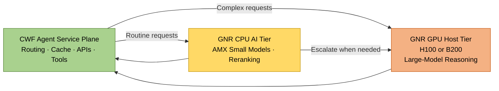

# Agent Workflow Optimization with Intel CWF, GNR, and H100/B200

Below, each metric keeps the **original flow** and adds a **recommended optimized flow**. The levels are architectural estimates for comparison, not benchmark measurements.

Intel positions Xeon P-cores such as GNR for compute-intensive, vector-based, AI, and accelerator-host workloads, while E-cores such as CWF target high-density, task-parallel workloads such as microservices. GNR provides AMX and AVX-512; CWF provides up to 288 E-cores per socket and is positioned for high agent density and parallel scale-out services.

## Level colors

| Level | Meaning | Color |
|---:|---|---|
| 1 | Very low | Green |
| 2 | Low | Light green |
| 3 | Medium | Yellow |
| 4 | High | Orange |
| 5 | Very high | Red |

# 1. Runtime-Optimized Flow

## Optimization strategy

The original flow is mostly sequential. The recommended flow:

- Starts context retrieval while the model is planning.
- Executes independent tools in parallel on CWF.
- Combines LLM validation and final-response generation.
- Retries only the failed tool instead of restarting the entire agent loop.

```mermaid
flowchart TB
    subgraph ORIGINAL["Original Runtime Flow — Overall Level 4"]
        direction LR
        OA["User Request<br/>Level 1<br/>CWF service node"]
        OB["Plan<br/>Level 2<br/>GNR + H100/B200"]
        OC["Retrieve + Act<br/>Level 3<br/>CWF worker pool"]
        OD["Check Result<br/>Level 2<br/>GNR + H100/B200"]
        OE["Final Answer<br/>Level 2<br/>GNR + H100/B200"]

        OA --> OB --> OC --> OD
        OD -->|Retry full loop| OB
        OD -->|Complete| OE
    end

    subgraph OPTIMIZED["Recommended Runtime Flow — Target Level 3"]
        direction LR
        NA["Route + Cache<br/>Level 1<br/>CWF service node"]
        NB["Plan<br/>Level 2<br/>GNR + H100/B200"]
        NC["Context Prefetch<br/>Level 2<br/>CWF worker pool"]
        ND["Parallel Tool Fan-Out<br/>Level 2<br/>CWF worker pool"]
        NE["Check + Final Answer<br/>Level 2<br/>GNR + H100/B200"]

        NA --> NB
        NA --> NC
        NB --> ND
        NC --> ND
        ND --> NE
        NE -->|Retry failed tool only| ND
    end

    classDef level1 fill:#63BE7B,stroke:#2E7D32,color:#000
    classDef level2 fill:#A9D18E,stroke:#548235,color:#000
    classDef level3 fill:#FFD966,stroke:#BF9000,color:#000
    classDef level4 fill:#F4B183,stroke:#C65911,color:#000
    classDef level5 fill:#E06666,stroke:#990000,color:#fff

    class OA,NA level1
    class OB,OD,OE,NB,NC,ND,NE level2
    class OC level3
```

## Why it is faster

| Change | Runtime benefit |
|---|---|
| CWF context prefetch runs beside planning | Hides retrieval latency |
| CWF executes API calls concurrently | Reduces serial tool waiting |
| Check and final answer share one GPU stage | Removes an extra orchestration transition |
| Selective retry | Avoids rerunning successful operations |
| GNR hosts the GPU stage | Supports latency-sensitive orchestration and data preparation |

## Positioning statement

> **Use GNR to shorten the critical path and CWF to parallelize everything around it.**

# 2. Power-Optimized Flow

## Optimization strategy

The original flow activates H100 or B200 for planning, checking, and final generation on every request.

The recommended flow:

- Uses a small quantized model on GNR AMX for routine planning.
- Runs tools and deterministic checks on CWF.
- Escalates only complex or ambiguous requests to H100/B200.
- Combines GPU reasoning and final generation into the escalation path.
- Batches escalated requests where latency requirements permit.

This matters because a B200 GPU can be configured up to 1,000 W, while an eight-GPU DGX B200 system is specified at up to 14.3 kW. Reducing GPU-active time can therefore materially reduce platform power.

```mermaid
flowchart TB
    subgraph ORIGINAL["Original Power Flow — GPU Active at Three Stages"]
        direction LR
        OA["User Request<br/>Level 1<br/>CWF service node"]
        OB["Plan<br/>Level 4–5<br/>GNR + H100/B200"]
        OC["Retrieve + Act<br/>Level 2<br/>CWF worker pool"]
        OD["LLM Check<br/>Level 4–5<br/>GNR + H100/B200"]
        OE["Final Answer<br/>Level 4–5<br/>GNR + H100/B200"]

        OA --> OB --> OC --> OD --> OE
    end

    subgraph OPTIMIZED["Recommended Power Flow — GPU Only When Required"]
        direction LR
        NA["Route + Cache<br/>Level 1<br/>CWF service node"]
        NB["Small-Model Plan<br/>Level 2<br/>GNR AMX CPU"]
        NC["Retrieve + Act<br/>Level 2<br/>CWF worker pool"]
        ND["Rule + Schema Check<br/>Level 1<br/>CWF service node"]
        NX{"Complex or<br/>ambiguous?"}
        NE["CPU Final Answer<br/>Level 2<br/>GNR AMX CPU"]
        NF["Batched Reasoning + Final<br/>Level 4–5<br/>GNR + H100/B200"]

        NA --> NB --> NC --> ND --> NX
        NX -->|No| NE
        NX -->|Yes| NF
        NF -->|Tool retry only| NC
    end

    classDef level1 fill:#63BE7B,stroke:#2E7D32,color:#000
    classDef level2 fill:#A9D18E,stroke:#548235,color:#000
    classDef level3 fill:#FFD966,stroke:#BF9000,color:#000
    classDef level4 fill:#F4B183,stroke:#C65911,color:#000
    classDef level5 fill:#E06666,stroke:#990000,color:#fff
    classDef decision fill:#E7E6E6,stroke:#7F7F7F,color:#000

    class OA,NA,ND level1
    class OC,NB,NC,NE level2
    class OB,OD,OE,NF level5
    class NX decision
```

## Why it uses less power

| Change | Power benefit |
|---|---|
| GNR AMX small-model planning | Avoids GPU activation for routine requests |
| CWF deterministic validation | Replaces an LLM check where rules are sufficient |
| Complexity-based escalation | Expensive GPU path serves only difficult tasks |
| GPU batching | Spreads accelerator power across multiple requests |
| CWF high-density workers | Consolidates many concurrent connectors and agent services |

## Important trade-off

CPU small-model inference may be slower than GPU inference for an individual request. This flow prioritizes **energy per completed task**, not minimum latency.

## Positioning statement

> **Use GNR AMX as the efficient AI gatekeeper, CWF as the task engine, and H100/B200 only as the high-power reasoning tier.**

# 3. Cost-Optimized Flow

## Optimization strategy

The original flow pays for a large-model GPU call during planning, checking, and final generation for every request.

The recommended flow introduces three economic paths:

1. **Cache hit:** return without model inference.
2. **Simple request:** use a small model on GNR AMX.
3. **Complex request:** send to a shared, highly utilized H100/B200 pool.

CWF consolidates routing, caches, connectors, retrieval, and tool execution across all paths.

```mermaid
flowchart TB
    subgraph ORIGINAL["Original Cost Flow — Large GPU Used for Every Request"]
        direction LR
        OA["User Request<br/>Level 1<br/>CWF service node"]
        OB["GPU Plan<br/>Level 3–4<br/>GNR + H100/B200"]
        OC["Retrieve + Act<br/>Level 2<br/>CWF worker pool"]
        OD["GPU Check<br/>Level 3–4<br/>GNR + H100/B200"]
        OE["GPU Final Answer<br/>Level 3–4<br/>GNR + H100/B200"]

        OA --> OB --> OC --> OD --> OE
    end

    subgraph OPTIMIZED["Recommended Cost Flow — Tiered Execution"]
        direction LR
        NA["Semantic Cache + Router<br/>Level 1<br/>CWF service pool"]
        NX{"Request path"}
        NB["Cached Response<br/>Level 1<br/>CWF cache"]
        NC["Small-Model Plan<br/>Level 2<br/>GNR AMX CPU"]
        ND["Batched Large-Model Plan<br/>Level 3<br/>Shared GNR + GPU pool"]
        NE["Pooled Retrieve + Tools<br/>Level 1–2<br/>CWF worker pool"]
        NF["Deterministic Check<br/>Level 1<br/>CWF service pool"]
        NG["CPU Final Answer<br/>Level 2<br/>GNR AMX CPU"]
        NH["Batched GPU Final<br/>Level 3<br/>Shared GNR + GPU pool"]

        NA --> NX
        NX -->|Cache hit| NB
        NX -->|Simple| NC
        NX -->|Complex| ND
        NC --> NE
        ND --> NE
        NE --> NF
        NF -->|Simple| NG
        NF -->|Complex| NH
    end

    classDef level1 fill:#63BE7B,stroke:#2E7D32,color:#000
    classDef level2 fill:#A9D18E,stroke:#548235,color:#000
    classDef level3 fill:#FFD966,stroke:#BF9000,color:#000
    classDef level4 fill:#F4B183,stroke:#C65911,color:#000
    classDef level5 fill:#E06666,stroke:#990000,color:#fff
    classDef decision fill:#E7E6E6,stroke:#7F7F7F,color:#000

    class OA,NA,NB,NE,NF level1
    class OC,NC,NG level2
    class ND,NH level3
    class OB,OD,OE level4
    class NX decision
```

## Why it costs less

| Change | Cost benefit |
|---|---|
| Semantic cache | Eliminates repeated inference and retrieval |
| CPU small-model tier | Avoids GPU cost for straightforward tasks |
| Shared GPU pool | Prevents expensive accelerator underutilization |
| Continuous or dynamic batching | Improves tokens generated per GPU-hour |
| CWF consolidation | Lowers service-plane cost per concurrent agent |
| Deterministic check | Removes a separate model-validation call |
| Model-size routing | Reserves the largest model for requests that need it |

## Positioning statement

> **CWF lowers cost per agent session through density, while GNR lowers cost per AI decision through AMX and efficient GPU hosting.**

# Consolidated Recommendation

| Optimization goal | Primary design change | CWF role | GNR role | GPU policy |
|---|---|---|---|---|
| **Runtime** | Parallel prefetch and tool execution | Parallel retrieval and tool fan-out | Critical-path orchestration and GPU hosting | Use immediately for planning and final response |
| **Power** | CPU-first processing with escalation | Routing, tools and deterministic checks | AMX small-model inference | Activate only for complex requests |
| **Cost** | Cache, model routing and batching | Dense shared service and tool pools | CPU inference plus shared GPU hosting | Pool and batch complex requests |

## Recommended overall architecture

The central architecture message is:

> **Runtime optimization uses CWF and GNR concurrently. Power optimization uses GNR before the GPU. Cost optimization uses CWF before both GNR and the GPU.**
