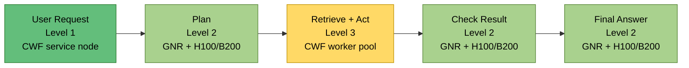
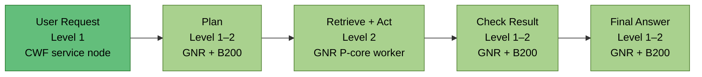
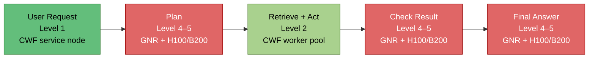
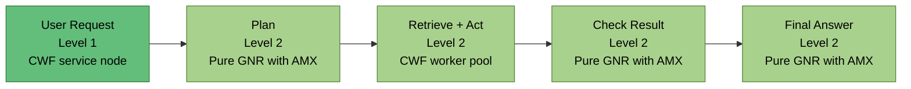
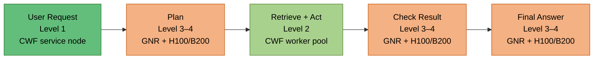
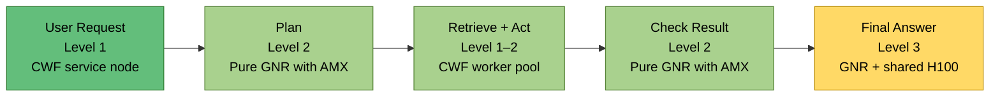

# Original and Platform-Optimized Agent Flows

Each optimized flow keeps the **same five boxes and the same sequence**. Only the platform assignment changes.

## Level colors

| Level | Meaning | Color |
|---:|---|---|
| 1 | Very low | Green |
| 2 | Low | Light green |
| 3 | Medium | Yellow |
| 4 | High | Orange |
| 5 | Very high | Red |

# 1. Runtime Flow

## Original

## Runtime-Optimized Platform Flow

## Platform Changes

| Box | Original | Runtime optimized | Reason |
|---|---|---|---|
| User Request | CWF | CWF | Routing remains highly parallel and lightweight |
| Plan | GNR + H100/B200 | **GNR + B200** | Prioritize fastest large-model inference |
| Retrieve + Act | CWF | **GNR P-core** | Improve latency for SQL, vector search, Python, and serialization |
| Check Result | GNR + H100/B200 | **GNR + B200** | Faster validation and reasoning |
| Final Answer | GNR + H100/B200 | **GNR + B200** | Faster token generation |

> **Runtime positioning:** CWF receives concurrent requests; GNR and B200 execute the latency-critical path.

The main change is replacing CWF with GNR in **Retrieve + Act**. This is appropriate when that stage contains compute-heavy retrieval, vector processing, data transformation, or code execution. For lightweight API waiting, CWF may perform similarly because the external service—not the CPU—is the bottleneck.

# 2. Power Flow

## Original

## Power-Optimized Platform Flow

## Platform Changes

| Box | Original | Power optimized | Reason |
|---|---|---|---|
| User Request | CWF | CWF | Efficient high-density service processing |
| Plan | GNR + GPU | **Pure GNR with AMX** | Avoid GPU activation |
| Retrieve + Act | CWF | CWF | High throughput per server for parallel tools |
| Check Result | GNR + GPU | **Pure GNR with AMX** | Run validation with a smaller CPU model |
| Final Answer | GNR + GPU | **Pure GNR with AMX** | Generate the response without GPU power |

> **Power positioning:** CWF handles scale-out services, while GNR AMX replaces the GPU for model inference.

This flow is appropriate for:

- Small or medium models
- Quantized models
- Routine enterprise agents
- Moderate concurrency
- Workloads where energy efficiency is more important than minimum latency

It is less appropriate for very large 70B+ models, frontier reasoning models, or strict high-throughput SLAs. In those cases, the final-answer box may still need an H100 or B200.

# 3. Cost Flow

## Original

## Cost-Optimized Platform Flow

## Platform Changes

| Box | Original | Cost optimized | Reason |
|---|---|---|---|
| User Request | CWF | CWF | Minimize service cost per concurrent session |
| Plan | GNR + GPU | **Pure GNR with AMX** | Remove one GPU inference stage |
| Retrieve + Act | CWF | CWF | Consolidate many tool workers per server |
| Check Result | GNR + GPU | **Pure GNR with AMX** | Remove another GPU inference stage |
| Final Answer | GNR + H100/B200 | **GNR + shared H100** | Preserve response quality while avoiding B200 cost |

> **Cost positioning:** use CWF for density, GNR AMX for intermediate intelligence, and a shared H100 only where model quality has the greatest user-visible value.

This differs from the power flow because it retains a GPU for final generation. The shared H100 provides stronger model capability than pure CPU inference but costs less than dedicating B200 resources to every stage.

# Final Comparison

| Goal | User Request | Plan | Retrieve + Act | Check Result | Final Answer |
|---|---|---|---|---|---|
| **Original** | CWF | GNR + H100/B200 | CWF | GNR + H100/B200 | GNR + H100/B200 |
| **Runtime optimized** | CWF | GNR + B200 | GNR | GNR + B200 | GNR + B200 |
| **Power optimized** | CWF | Pure GNR AMX | CWF | Pure GNR AMX | Pure GNR AMX |
| **Cost optimized** | CWF | Pure GNR AMX | CWF | Pure GNR AMX | GNR + shared H100 |

## Simplified Positioning

- **Save runtime:** replace CWF compute stages with GNR and prefer B200.
- **Save power:** replace GPU inference stages with pure GNR AMX.
- **Save cost:** use pure GNR for intermediate model calls and reserve a shared H100 for the final answer.
