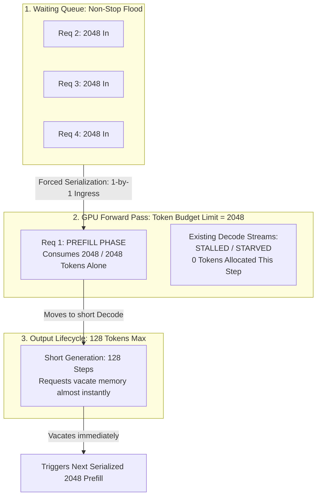
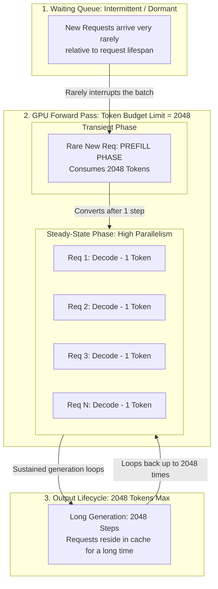

# Ultimate Performance Report: vLLM Concurrency Bottleneck Analysis on Llama-3.1-8B
**Focus:** The Input 2048 / Output 128 vs. Input 2048 / Output 2048 Paradox

---

## 1. Executive Summary
A counterintuitive performance paradox occurs in vLLM deployments when using Llama-3.1-8B: a workload requesting **fewer total tokens** (2048 In / 128 Out) yields a **lower maximum concurrency** than a workload requesting significantly more tokens (2048 In / 2048 Out).

The absolute root cause is **Ingress Ingestion Starvation caused by Exclusive Prefill Serialization**. Due to vLLM's internal token budget constraint (`max_num_batched_tokens`), large input prompts completely serialize the engine when request turnover is too high.

---

## 2. Fully Tracked Architectural Diagrams (Side-by-Side Comparison)

The diagrams below map the exact same 3-stage architecture. Notice how Scenario B handles the Prefill phase cleanly via temporal dilation, whereas Scenario A gets choked at the ingress gate.

### Scenario A: 2048 In / 128 Out (The "Ingress Jam" Loop)
*Requests finish so fast that the engine is trapped in a non-stop, serialized Prefill cycle, starving any parallel scaling.*

---

### Scenario B: 2048 In / 2048 Out (The Prefill-to-Decode Steady State)
*The initial Prefill phase happens once, but because the request stays for 2048 iterations, the prefill frequency is heavily diluted, allowing hundreds of requests to co-decode smoothly.*

---

## 3. Deep Dive Analysis: Why Doesn't Scenario B Starve?

If every request in Scenario B also begins with a massive 2048-token prefill, why doesn't it experience the same concurrency collapse as Scenario A? 

### A. The "Token Consumption Rate" Asymmetry
* **Prefill Phase Cost:** A request in the prefill phase costs **$N$ tokens** (where $N = \text{prompt length} = 2048$). It saturates vLLM's default scheduling budget completely.
* **Decode Phase Cost:** A request in the decode phase costs exactly **$1$ token per step**, completely independent of the prompt context size.

In Scenario B, once a request clears its very first iteration (Prefill), it converts into a Decode sequence. Because it now only demands **1 token** per step, vLLM's `PagedAttention` engine can easily bundle up to 2,048 concurrent decode requests into a single GPU forward pass without exceeding the token allocation budget. 

### B. Temporal Dilation & Low Ingress Turnover Rate
Think of the vLLM engine scheduler as an airport security line:
* **In Scenario A (2048/128):** Passengers check in (2048 tokens prefill), board a tiny 5-minute flight (128 tokens decode), and leave. Because flights are so short, a massive queue of new passengers is constantly slamming the check-in desk. The check-in desk (Prefill) is perpetually overwhelmed, freezing the runway (Decode).
* **In Scenario B (2048/2048):** Passengers check in (2048 tokens prefill), but then board an international 15-hour cruise (2048 tokens decode). Because passengers stay on board for a very long duration, **the relative arrival rate of new passengers drops to near zero**. 

The scheduler spends 99.9% of its cycles running in a **pure, steady-state decode environment**. A 2048-token prefill is executed so rarely that it almost never interrupts the running decode streams, bypassing the starvation loop entirely.

---

## 4. Production Remediation & Tuning Guide

To eliminate the prefill serialization bottleneck and achieve maximum concurrency in short-output (2048/128) scenarios, adjust your vLLM engine initialization flags:

### 1. Enable Chunked Prefill (The Primary Fix)
Add `--enable-chunked-prefill=True` to your startup parameters.
* **Mechanism:** This instructs the vLLM scheduler to slice your 2048-token prompt into smaller chunks (e.g., 512 tokens). 
* **Impact:** Instead of one single prompt hijacking the entire budget block, chunks of new prefills can be cleanly co-scheduled alongside running decodes in the same iteration step.

### 2. Double the Batched Token Limit
Increase `--max-num-batched-tokens` to **4096** or **8192** (VRAM permitting).
* **Mechanism:** Expands the scheduler's single-step token allocation cap.
* **Impact:** Allows the engine to ingest 2 to 4 full 2048-token prompts simultaneously in a single forward pass, unlocking immediate parallel prefilling.

### 3. Constraint the Max Model Length
Explicitly declare `--max-model-len=2200`.
* **Mechanism:** Overrides the model's default long context windows (which can be up to 128k for Llama 3.1).
* **Impact:** Prevents vLLM from making overly conservative virtual KV cache memory reservations, freeing up more physical slots for active concurrent sequences (`--max-num-seqs`).

