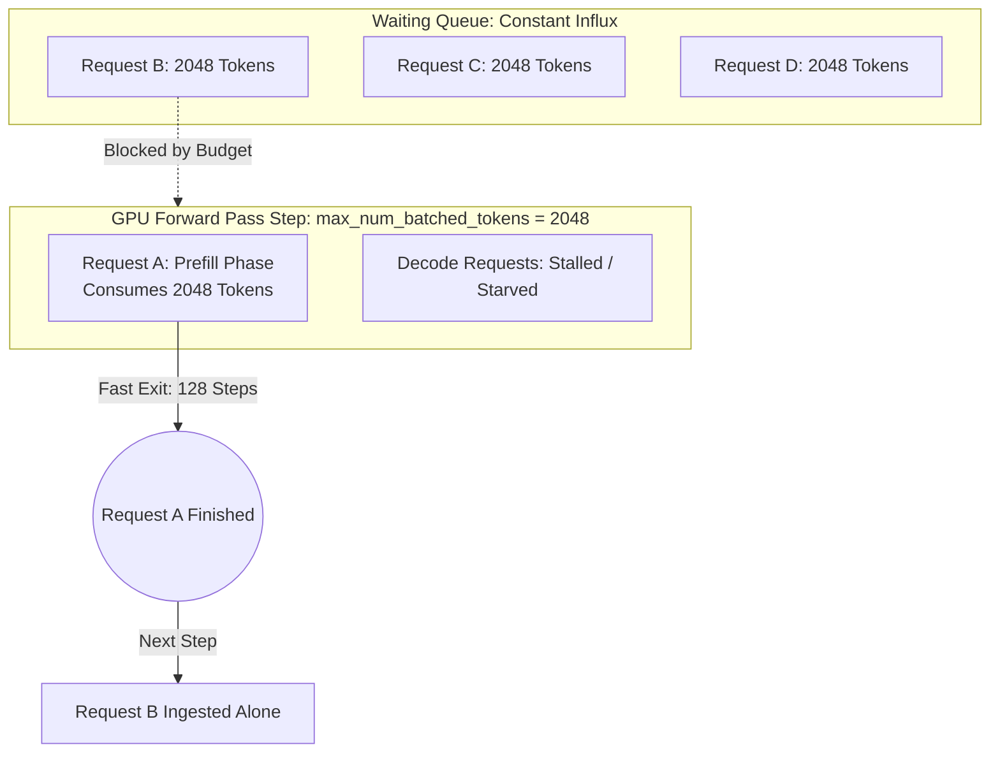
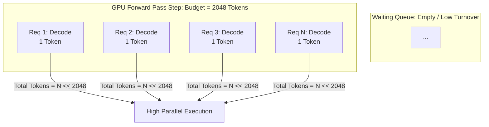
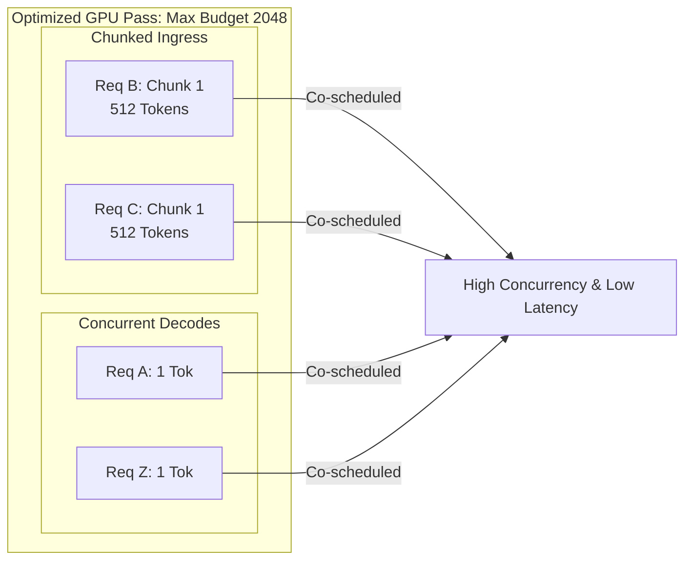

# Performance Analysis: vLLM Concurrency Bottleneck on Llama-3.1-8B
**Scenario Analysis:** Comparing Input 2048 / Output 128 vs. Input 2048 / Output 2048

---

## 1. Executive Summary
A counterintuitive performance paradox was observed on Llama-3.1-8B inside vLLM: a workload with **shorter total generation** (2048 In / 128 Out) yields **significantly less maximum concurrency** than a workload with longer generation (2048 In / 2048 Out).

The primary root cause is **Ingress Ingestion Starvation caused by Exclusive Prefill Serialization**. This is an architectural side effect of vLLM's internal token budget constraint (`max_num_batched_tokens`), which serializes large incoming prompts when the engine faces high request turnover.

---

## 2. Deep Dive Root Cause Analysis

### A. The 2048 / 128 Bottleneck (The Forced Serializer)
1. **Token Budget Exhaustion:** By default, vLLM regulates single-iteration execution blocks using `--max-num-batched-tokens` (commonly defaulting to **2048**).
2. **One Request Per Iteration:** Because your input prompt is exactly 2048 tokens, **a single new request completely consumes the entire step's token budget**. 
3. **The Ingress Jam:** Because outputs are short (128 tokens), requests complete and vacate the system rapidly. This creates a continuous, high-volume flood of pending requests in the `waiting` queue. 
4. **Forced Serialization:** To respect the 2048 token limit, vLLM's scheduler is forced to process these pending requests **strictly one by one** per forward pass. The GPU sits underutilized because the scheduler software limits parallel ingress.

### B. The 2048 / 2048 Scenario (The Steady-State Parallelizer)
1. **Long Lifecycle:** While this scenario experiences the same initial prefill queueing delays, requests stay inside the engine for a long duration (2048 decode iterations).
2. **Decode Dominance:** Once requests survive the initial prefill stage, they enter a steady-state decode phase. During decode, each sequence only consumes **1 token per iteration**.
3. **True Parallelization:** The 2048-token scheduling budget can now easily pack hundreds of sequences simultaneously. This leverages the full capacity of `PagedAttention`, resulting in much higher active concurrency.

---

## 3. Architecture Diagrams (Mermaid Format)

### Scenario A: 2048 In / 128 Out (Bottlenecked Ingress)


### Scenario B: 2048 In / 2048 Out (Steady-State Co-Scheduling)


### Mitigated State: Chunked Prefill Enabled


---

## 4. Immediate Action & Remediation

To unlock high concurrency for short-output workloads, modify your vLLM initialization flags using these three configurations:

1. **Enable Chunked Prefill:**
   ```bash
   python3 -m vllm.entrypoints.openai.api_server \
       --model meta-llama/Llama-3.1-8B \
       --enable-chunked-prefill=True
   ```
   *Why:* This chops the 2048-token prompts into smaller pieces (e.g., 512), allowing vLLM to blend multiple prefills and decodes in a single execution block.

2. **Increase Batched Token Capacity:**
   ```bash
   --max-num-batched-tokens 4096
   ```
   *Why:* If your GPU VRAM permits, doubling this limit allows the scheduler to ingest at least 2 full 2048 prompts simultaneously.

3. **Clamp Max Model Length:**
   ```bash
   --max-model-len 2200
   ```
   *Why:* Prevents vLLM's virtual memory management from making overly conservative KV block allocations based on the model's default long context windows.
